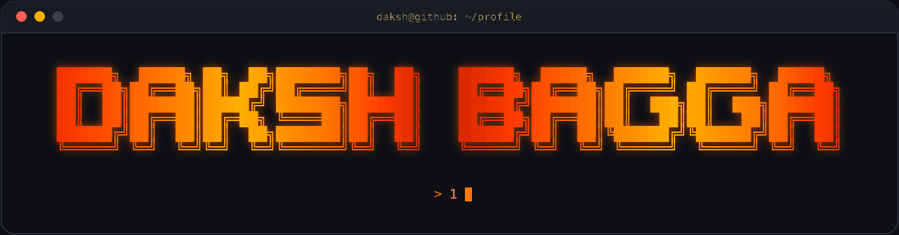

  

  📍 India ·
  <a href="https://linkedin.com/in/daksh-bagga1">LinkedIn</a> ·
  <a href="mailto:dakshbagga54@gmail.com">Email</a>

  
  
  
  
  
  
  

---

### 🚀 About

I'm an Enterprise Solutions Engineer who partners with sales and product teams to scale customer-facing GenAI, RAG, and voice pipelines — owning discovery, demos, integration architecture, and rollout. Strong Python depth across **RAG, agents, voice pipelines, and MCP integrations**, and the builder of a voice-enabled agent platform with **1200+ integrations**.

- 🔭 Currently building customer-facing AI systems at **Nektar.ai**
- 🧠 Working across RAG, LLM evaluation, agentic workflows, guardrails, and STT/TTS pipelines
- 🤝 Trusted technical voice for AI-native accounts
- 💬 Ask me about MCP integrations, voice agents, or taking a GenAI PoC to paid adoption

---

### 🛠️ Tech Stack

**Languages & Core**&nbsp;&nbsp;Python · Swift · SQL · JavaScript / TypeScript · software architecture · integration patterns

**GenAI / LLM**&nbsp;&nbsp;RAG · vector DBs · LangChain · MCP · OpenAI · Llama 3 · Ollama · prompt engineering · LLM evaluation · agentic workflows · guardrails

**Voice & APIs**&nbsp;&nbsp;Voice agents · STT/TTS pipelines · OpenAI Whisper · REST · GraphQL · FastAPI · Node.js · Postman · webhooks

**Engineering & Ops**&nbsp;&nbsp;Docker · GitHub Actions · CI/CD · observability · root-cause analysis · PostgreSQL · MongoDB

---

### 📌 Featured Projects

| Project | What it does |
| --- | --- |
| **casprFlow** | Native Swift app for real-time voice — **sub-60ms TTS and STT** with a **sub-200ms dispatcher**, engineered for low-latency on-device speech interaction. |
| **ObsTell** | Voice-enabled shared-context platform coordinating humans and AI agents — **1200+ MCP integrations** aggregating chat, tickets, code, and production signals into unified threads, plus a Whisper-powered voice agent for spoken queries and thread summaries. |
| **Instant Web RAG Crawler** | One-click crawl-to-vector-DB ingestion (Python · Chroma · LangChain) with chunking, embeddings, retrieval, and memory — sub-second chat over long-form content. |
| **Agentic Web Browser** | Forked a Firefox base and embedded a local LLM agent (Ollama · LangChain) for browser task execution, retrieval, and privacy-preserving automation. |

---

### 💼 Experience

- **Nektar.ai** — Enterprise Solutions Engineer, Customer-Facing AI Systems *(Jun 2025 – Present)*
- **ISS STOXX** — AI Quality Engineer, Client-Facing Automation *(Jan 2024 – May 2025)*
- **DefinEquity Investment Managers** — Data Analyst Intern *(2023)*

🎓 B.Tech, Computer Science (AI/ML) — Vellore Institute of Technology, Chennai · CGPA 9.18/10

---

### 📈 Contribution Activity

  

---

  
  

<i>Trusted technical voice for getting GenAI from evaluation to production.</i>

